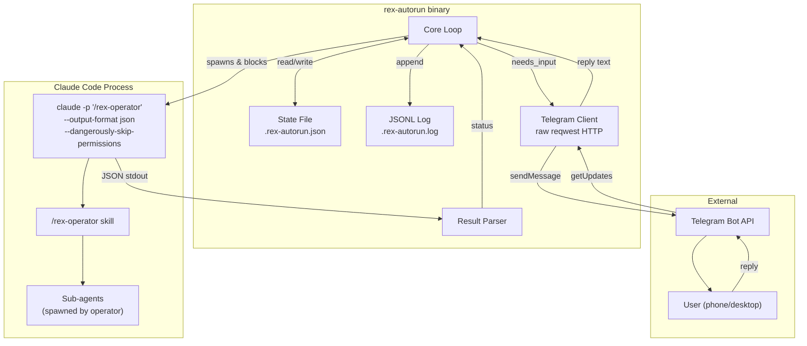
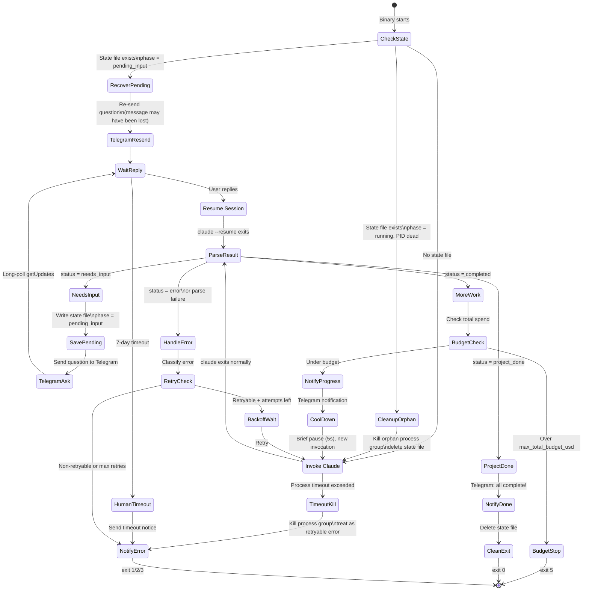
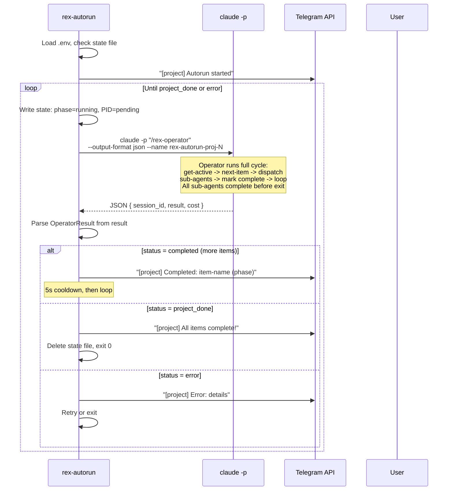
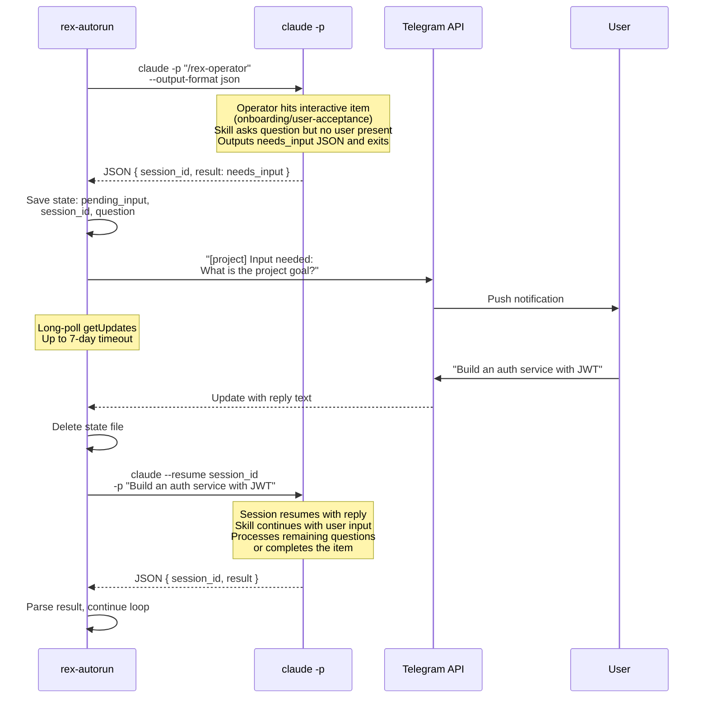
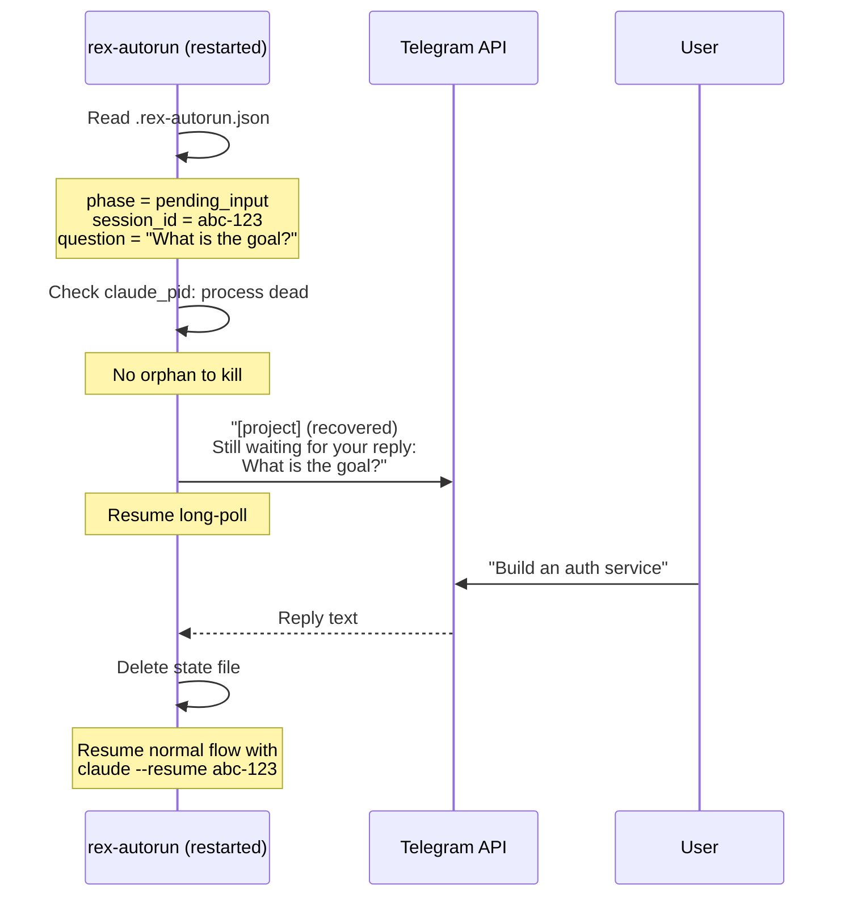
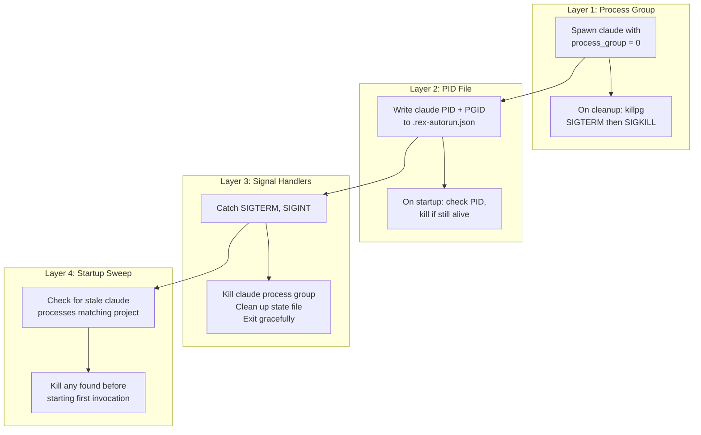

# Rex Autorun — Implementation Plan

## Executive Summary

Rex Autorun is a **single Rust binary** (`rex-autorun`) that drives a rex project to completion unattended. It repeatedly invokes Claude Code's `/rex-operator` skill in headless mode (`claude -p`), parses the structured JSON output, and loops. When the operator needs human input (onboarding questions, design acceptance), the binary relays the question to Telegram and waits for a reply. When the operator completes work, the binary starts a fresh invocation. The binary manages **one project per instance**, persists state to disk for crash recovery, and prevents session leaks through process group management.

No broker. No IPC. No multi-project multiplexing. One binary, one project, one Telegram chat.

**The binary can be started by a human or by another agent** (via Bash tool). It writes structured JSONL progress to its log file so callers can monitor status.

---

## Architecture



**Key constraint:** The `claude -p` process must be run from the **rex project root directory** (where `rex/projects.json`, `.claude/skills/`, and `CLAUDE.md` live). The target project's working directory is stored in `projects.json` and the operator/skills handle it internally. **Do not use `--bare`** — skills must be auto-discovered.

---

## Core Loop — State Machine



---

## Sequence Diagram — Normal Flow (Non-Interactive Items)



---

## Sequence Diagram — Interactive Item (Needs Input)



---

## Sequence Diagram — Crash Recovery



---

## Features (v1 Scope)

| # | Feature | Description |
|---|---------|-------------|
| 1 | **Headless operator loop** | Invoke `/rex-operator` via `claude -p`, parse JSON result, loop until project done |
| 2 | **Telegram relay** | Send questions to user, receive replies, send completion/error notifications |
| 3 | **State persistence** | Survive crashes via `.rex-autorun.json` — recover pending input, clean up orphans |
| 4 | **Session leak prevention** | Process group management, PID tracking, startup orphan sweep, signal handlers |
| 5 | **Retry with backoff** | Exponential backoff for transient Claude CLI and Telegram API failures |
| 6 | **Configurable limits** | Per-invocation budget, **global total budget cap**, max turns, process timeout — all with sensible defaults |
| 7 | **Structured logging** | JSONL to log file + human-readable to stderr, with timestamps |
| 8 | **Session tagging** | Every Claude session named `rex-autorun-<project-id>-<N>` for identification |
| 9 | **Exit codes** | Meaningful exit codes so callers (human or agent) know what happened |
| 10 | **Cooldown between invocations** | Brief pause (5s) between operator invocations to avoid hammering the API |

---

## Operator Skill Contract

This is the **only interface** between the autorun binary and Claude's output. Two things must work together:
1. The **operator skill itself** must detect headless mode and short-circuit interactive items
2. The **binary** must append a system prompt defining the JSON output contract

### Required modification to `/rex-operator` skill (SKILL.md)

The operator skill currently has no awareness of headless mode. Its Step 6 says _"Direct invoke: you execute the skill yourself. The user will talk directly to the skill through you."_ In headless `-p` mode, there is no user — the operator would invoke the interactive skill, the skill would generate a question, and the operator would continue through Steps 8-12, potentially hallucinating a user response or leaving the item in a broken state.

**The skill must be modified to add a headless-mode branch.** Add this check at the **top of Step 6** (before determining dispatch mode):

```
### Headless mode check (REX_AUTORUN=1)

If the environment variable `REX_AUTORUN=1` is set, this session is running
inside the rex-autorun headless harness. There is no human at the terminal.

For items that would normally use **direct invoke** (onboarding, user-support,
user-acceptance):

1. Do NOT invoke the skill.
2. Do NOT proceed to Step 7.
3. Instead, determine the first question the skill would ask. Read the skill's
   SKILL.md to understand what it needs from the user.
4. Output the following JSON as your FINAL line and STOP:

   {"status": "needs_input", "message": "<the exact question for the user>"}

5. Do not output anything after this JSON. Do not continue to Step 7, 8, 9, etc.

When the session is resumed with the user's reply (via --resume <id> -p "<reply>"),
pick up from where you left off: the reply is the user's answer. Feed it into the
skill and continue. If the skill needs more input, output another needs_input JSON
and stop again. Repeat until the skill completes.

For non-interactive items (sub-agent dispatch), proceed normally — REX_AUTORUN=1
does not affect them.
```

This is the **most critical change** in the entire plan. Without it, the autorun binary has no reliable way to intercept interactive items before the operator barrels through its step sequence.

### Appended system prompt (injected by the binary)

The binary also appends a system prompt to every `claude -p` invocation to define the JSON output format for all terminal states (not just interactive items). **The append system prompt alone is NOT sufficient** — it tells Claude what JSON to output, but does not override the operator skill's explicit step-by-step instructions. The skill modification above is what actually prevents the runaway behavior. The system prompt is belt-and-suspenders.

```
You are running inside the rex-autorun headless harness. The environment variable REX_AUTORUN=1 is set.

CRITICAL: When your work for this invocation is complete, you MUST output exactly one JSON object
as the VERY LAST LINE of your response. Nothing may follow it.

Use one of these four statuses:

Completed work (more items may remain in project-status.json):
{"status": "completed", "message": "<1-sentence summary of what was done>"}

Project fully complete (no more work items exist):
{"status": "project_done", "message": "All items completed."}

Blocked on human input (interactive item — onboarding, user-acceptance, etc.):
{"status": "needs_input", "message": "<the exact question the user must answer>"}

Error (unrecoverable problem):
{"status": "error", "message": "<what went wrong>"}

When resuming a session after the user replies via Telegram, their reply arrives as the -p prompt.
Treat it as the user's answer to your last question and continue the skill's flow.
```

### Parsing strategy in the binary

```
1. Get `result` field from Claude's JSON output
2. Search BACKWARD from end of `result` for the literal `{"status":`
3. From that position, take the substring to the next `}` (inclusive)
4. Parse that substring as OperatorResult
5. If all parsing fails, treat the entire invocation as an error
```

**Why backward search for `{"status":`:** The `message` field frequently contains braces — code snippets, struct names like `{Config}`, display impls. A naive backward search for `{` would land inside the message content, not the JSON envelope. Searching for the specific `{"status":` pattern is both the primary and only strategy — no fragile fallback chain. Searching backward ensures we find the last occurrence (the operator's terminal output), not an earlier one that might appear in log text.

---

## Claude CLI Commands Used

### New invocation

```bash
claude -p "/rex-operator" \
  --output-format json \
  --dangerously-skip-permissions \
  --name "rex-autorun-<project-id>-<N>" \
  --max-turns 200 \
  --max-budget-usd 50.00 \
  --append-system-prompt "<autorun system prompt>"
```

### Resume with user reply

```bash
claude --resume "<session-id>" \
  -p "<user reply text>" \
  --output-format json \
  --dangerously-skip-permissions \
  --max-turns 200 \
  --max-budget-usd 50.00 \
  --append-system-prompt "<autorun system prompt>"
```

**Important:** `--append-system-prompt` must be passed on every invocation, including resumes. Sessions persist conversation messages, not CLI flags. The system prompt is reconstructed each invocation from the environment. If the appended prompt is omitted on resume, the JSON output contract is lost and the binary cannot parse the result. This is harmless if it does somehow persist, but fatal if it doesn't.

### Key flags and why each is used

| Flag | Purpose | Why required |
|------|---------|--------------|
| `-p "<prompt>"` | Headless mode | Runs agent loop and exits — no interactive TTY |
| `--output-format json` | Structured output | Gives us `session_id`, `result`, `cost`, `duration_ms` |
| `--dangerously-skip-permissions` | No prompts | Fully unattended — no human at the terminal |
| `--name "..."` | Session tagging | Identify which sessions belong to this autorun instance |
| `--resume "<id>"` | Continue session | Pick up where the operator left off after user replies |
| `--max-turns N` | Safety net | Prevent runaway agent loops |
| `--max-budget-usd N` | Cost control | Cap spend per invocation |
| `--append-system-prompt` | Inject contract | Tell Claude to output structured JSON status |

### Flags explicitly NOT used

| Flag | Why not |
|------|---------|
| `--bare` | Skills, CLAUDE.md, hooks, and memory must be auto-discovered |
| `--worktree` | Session isolation not needed — operator handles one item at a time |
| `--continue` | We always use explicit `--resume <session-id>` for precision |
| `--no-session-persistence` | We need sessions persisted so we can resume after user replies |

---

## Session Tagging & Tracking

### Naming convention

```
rex-autorun-<project-id>-<invocation-number>
```

Example: `rex-autorun-auth-system-7`

This enables:
- **Identification**: Any `claude` session named `rex-autorun-*` was created by this binary
- **Project scoping**: The project-id segment ties sessions to a specific project
- **Ordering**: The invocation number shows sequence
- **Manual intervention**: A human can `claude --resume "rex-autorun-auth-system-7"` to inspect

### Session ID capture

Every `claude -p` call returns a `session_id` in the JSON output. The binary:
1. Captures the session ID immediately after `claude` exits
2. Stores it in the state file (for crash recovery and resume)
3. Logs it to the JSONL log (for audit trail)

### Sessions are per-directory

Claude Code stores sessions keyed by working directory. Since the autorun always runs `claude` from the rex project root, all sessions for all invocations share the same session store. The `--name` tag differentiates them.

---

## Session Leak Prevention

### The problem

When `claude -p` runs the operator, the operator may spawn sub-agent processes (via Claude Code's Agent tool). If the main `claude` process dies unexpectedly, those sub-agents become orphans — still running, still consuming API tokens, potentially writing conflicting changes to the project.

### Why it's less dangerous than it sounds

The operator skill explicitly requires **blocking dispatch**: _"Never launch agents in the background. Always wait for completion."_ Under normal operation, when `claude -p` exits cleanly, **all sub-agents have already completed**. Session leak only occurs on abnormal termination (crash, kill, timeout).

### Prevention: four layers



**Layer 1 — Process group isolation:**
```rust
let mut cmd = tokio::process::Command::new("claude");
cmd.process_group(0);   // new process group (child is group leader)
cmd.kill_on_drop(true);  // SIGKILL on handle drop
```

On timeout or error, escalating kill:
```rust
// SIGTERM first (graceful — claude will clean up sub-agents)
unsafe { libc::killpg(pgid, libc::SIGTERM); }
tokio::time::sleep(Duration::from_secs(5)).await;
// SIGKILL if still alive (nuclear option)
unsafe { libc::killpg(pgid, libc::SIGKILL); }
```

**Layer 2 — PID tracking in state file:**

Before spawning `claude`, write `{ claude_pid, claude_pgid, phase: "running" }` to `.rex-autorun.json`. On next startup:
1. Read the state file
2. If `claude_pid` is present, check if process is alive (`kill(pid, 0)`)
3. If alive, kill the process group (`killpg(pgid, SIGTERM)`)
4. Wait, then force kill if needed
5. Continue with normal startup

**Layer 3 — Signal handlers:**

```rust
let ctrl_c = tokio::signal::ctrl_c();
let mut sigterm = tokio::signal::unix::signal(SignalKind::terminate())?;

tokio::select! {
    _ = ctrl_c => { cleanup_and_exit(); }
    _ = sigterm.recv() => { cleanup_and_exit(); }
    result = main_loop() => { /* normal flow */ }
}
```

**Layer 4 — Startup orphan sweep:**

Before the first invocation, check for any stale `claude` processes that might be left over from a crashed binary that lost its state file:
```rust
// Check for claude processes in our project directory
// This is a best-effort safety net, not a primary mechanism
```

### What about Claude's internal sub-agent cleanup?

When a parent `claude` process receives SIGTERM:
1. It cancels in-flight API requests
2. It sends SIGTERM to child processes (sub-agents) via `kill_on_drop`
3. It exits

Our process group kill ensures that **even if Claude's internal cleanup fails**, all processes in the group (parent + all descendants) receive the signal. This is belt-and-suspenders.

### Timeout kills and project state consistency

When the binary kills a `claude` process due to timeout, the operator may have left items or tasks in `in-progress` status. On the next invocation:

- `rex project next-item` returns the next actionable item. If an item is `in-progress`, the operator's Step 3 will pick it up again (the `next-item` command returns in-progress items before not-started ones).
- `rex task next` similarly returns in-progress tasks before not-started ones.
- Partially written output files may exist. The new invocation's sub-agent will overwrite them.

This means timeout kills are **self-healing** — the next invocation naturally retries the interrupted work. The only risk is partially committed code changes (e.g., half a refactor), but this is inherent to killing any coding agent mid-work and is not unique to the autorun. The operator's blocking dispatch model limits this risk: sub-agents complete fully before the operator marks anything complete, so a timeout during sub-agent work means nothing was marked done.

---

## State Persistence

Single file: `<rex-project-root>/.rex-autorun.json`

### Atomic writes

All state file writes use the write-to-temp, fsync, rename pattern to prevent corruption on crash:

```rust
fn write_state_atomic(path: &Path, state: &AutorunState) -> anyhow::Result<()> {
    let tmp = path.with_extension("json.tmp");
    let data = serde_json::to_string_pretty(state)?;
    let mut file = std::fs::File::create(&tmp)?;
    file.write_all(data.as_bytes())?;
    file.sync_all()?; // fsync — flush to disk
    std::fs::rename(&tmp, path)?; // atomic on POSIX
    Ok(())
}
```

With this pattern, the state file is either fully written (rename succeeded) or absent (crash before rename). The `.json.tmp` file is a harmless artifact that gets overwritten on the next write. On startup, delete `.rex-autorun.json.tmp` if it exists.

### State transitions

| Event | State written |
|-------|--------------|
| Binary starts (fresh) | No file yet |
| Before spawning `claude` | `{ phase: "running", claude_pid, claude_pgid, invocation_n, stats }` |
| `claude` exits with `needs_input` | `{ phase: "pending_input", session_id, question, telegram_msg_id, stats }` |
| Telegram reply received | File deleted |
| `claude` exits with `completed` | File deleted (brief — immediately starting next invocation) |
| Project done | File deleted |
| Signal caught (SIGTERM/SIGINT) | File deleted after cleanup |
| Binary crashes | File remains — recovered on next startup |

### Recovery matrix

| State file contents | Recovery action |
|--------------------|-----------------|
| `phase: running`, PID alive | Kill process group, start fresh |
| `phase: running`, PID dead | Process already exited — start fresh |
| `phase: pending_input`, has session_id | Re-send question to Telegram, wait for reply, resume |
| `phase: pending_input`, no session_id | Corrupt state — delete file, start fresh |
| File exists but JSON parse fails | Corrupt file (pre-atomic-write crash) — delete file, start fresh |
| `.json.tmp` exists, `.json` absent | Crash during write — delete tmp, start fresh |
| No file | Clean start |

---

## Telegram Integration

### Approach: raw HTTP via reqwest

No `teloxide` framework. Direct HTTP calls to `https://api.telegram.org/bot<token>/`. This minimizes dependencies and complexity.

### API endpoints used

| Method | Endpoint | Purpose |
|--------|----------|---------|
| POST | `/sendMessage` | Send questions and notifications |
| POST | `/getUpdates` | Long-poll for user replies |

### Message formatting

**Input needed:**
```
[auth-system] Input needed:

What is the primary goal of your project? Please describe what you're building,
who it's for, and what problem it solves.

(Reply to this message with your answer)
```

**Item completed:**
```
[auth-system] Completed: goal (onboarding)
Cost: $1.23 | Duration: 45s | Invocation: #3
```

**Project done:**
```
[auth-system] Project complete!
Total invocations: 27 | Total cost: $89.45 | Duration: 6h 12m
```

**Error:**
```
[auth-system] Error: Claude CLI exited with code 1
Retrying in 60s (attempt 2/5)
```

**Autorun started:**
```
[auth-system] Autorun started
Project: My Auth System
Directory: /Users/shaun/Code/auth-system
```

### Reply detection

1. Send question via `sendMessage`, capture returned `message_id`
2. Long-poll `getUpdates` with `timeout=30` seconds (Telegram server holds the connection)
3. Loop until a matching reply arrives:
   - Filter: `update.message.chat.id == TELEGRAM_CHAT_ID`
   - Accept: any text message from that chat while we're in `pending_input` state
4. Return the reply text
5. If 7 days pass with no reply, treat as timeout error

### Update offset persistence

The `update_offset` (Telegram's cursor for `getUpdates`) is persisted in `.rex-autorun.json` alongside other state. On startup/recovery, the `TelegramClient` initializes its offset from the state file. This prevents replaying stale messages after a crash — without it, a reply received between crash and restart could be incorrectly matched to a different question on the next `pending_input` cycle.

### Retry on Telegram API failures

Telegram's API can return 429 (rate limit) or 5xx (server error). Retry with exponential backoff:
- Attempt 1: wait 10s
- Attempt 2: wait 20s
- Attempt 3: wait 40s
- Attempt 4: wait 80s
- Attempt 5: give up (but don't crash — the question is persisted in the state file)

### Single-bot constraint

Telegram's `getUpdates` API is exclusive — only one process can poll a bot at a time. This is why the binary manages **one project per instance**. To run multiple projects concurrently, use separate Telegram bots (one per project). Multi-project multiplexing with a broker process is a v2 concern.

---

## Data Structures

### CLI arguments

```rust
use std::path::PathBuf;
use clap::Parser;

#[derive(Parser)]
#[command(name = "rex-autorun", about = "Headless autopilot for rex projects")]
struct Args {
    /// Rex project root directory (default: current directory)
    #[arg(long, default_value = ".")]
    project_dir: PathBuf,

    /// Max USD budget per claude invocation
    #[arg(long, default_value = "50.0")]
    max_budget_usd: f64,

    /// Max total USD budget across ALL invocations (hard stop)
    #[arg(long, default_value = "500.0")]
    max_total_budget_usd: f64,

    /// Max agentic turns per claude invocation
    #[arg(long, default_value = "200")]
    max_turns: u32,

    /// Claude process timeout in minutes
    #[arg(long, default_value = "60")]
    process_timeout_mins: u64,

    /// Max retries for transient failures
    #[arg(long, default_value = "5")]
    max_retries: u32,

    /// Human reply timeout in days
    #[arg(long, default_value = "7")]
    human_timeout_days: u64,

    /// Log file path (default: <project-dir>/.rex-autorun.log)
    #[arg(long)]
    log_file: Option<PathBuf>,
}
```

### Operator result (parsed from Claude's output)

```rust
#[derive(Debug, serde::Deserialize)]
struct OperatorResult {
    status: OperatorStatus,
    #[serde(default)]
    message: String,
}

#[derive(Debug, serde::Deserialize, PartialEq)]
#[serde(rename_all = "snake_case")]
enum OperatorStatus {
    Completed,
    ProjectDone,
    NeedsInput,
    Error,
}
```

### Claude process output

```rust
#[derive(Debug, serde::Deserialize)]
struct ClaudeOutput {
    result: String,
    session_id: String,
    cost: ClaudeCost,
    duration_ms: u64,
}

#[derive(Debug, serde::Deserialize)]
struct ClaudeCost {
    input_tokens: u64,
    output_tokens: u64,
    total_cost: f64,
}
```

### Persisted state (crash recovery)

```rust
#[derive(Debug, serde::Serialize, serde::Deserialize)]
struct AutorunState {
    phase: AutorunPhase,
    session_id: Option<String>,
    claude_pid: Option<u32>,
    claude_pgid: Option<i32>,
    pending_question: Option<String>,
    telegram_message_id: Option<i64>,
    /// Telegram getUpdates offset — persisted to avoid replaying stale messages after crash
    telegram_update_offset: Option<i64>,
    invocation_count: u32,
    updated_at: String,  // ISO 8601
    stats: RunStats,
}

#[derive(Debug, serde::Serialize, serde::Deserialize)]
#[serde(rename_all = "snake_case")]
enum AutorunPhase {
    Running,
    PendingInput,
}

#[derive(Debug, Default, serde::Serialize, serde::Deserialize)]
struct RunStats {
    invocations_completed: u32,
    items_completed: u32,
    total_cost_usd: f64,
    started_at: String,
}
```

### Telegram client

```rust
struct TelegramClient {
    token: String,
    chat_id: i64,
    http: reqwest::Client,
    /// Track getUpdates offset to avoid processing old messages
    update_offset: i64,
}

impl TelegramClient {
    fn new(token: String, chat_id: i64) -> Self;

    /// Send a message, return the message_id
    async fn send_message(&self, text: &str) -> anyhow::Result<i64>;

    /// Long-poll for a reply from the user, with timeout
    async fn wait_for_reply(&mut self, timeout: Duration) -> anyhow::Result<String>;

    /// Fire-and-forget notification (retries internally)
    async fn notify(&self, text: &str);
}
```

### JSONL log events (written to .rex-autorun.log)

```rust
#[derive(serde::Serialize)]
#[serde(tag = "event")]
enum LogEvent {
    Started {
        project_id: String,
        timestamp: String,
    },
    InvocationStarted {
        n: u32,
        timestamp: String,
    },
    InvocationCompleted {
        n: u32,
        status: String,
        message: String,
        session_id: String,
        cost_usd: f64,
        duration_ms: u64,
        timestamp: String,
    },
    NeedsInput {
        question: String,
        session_id: String,
        timestamp: String,
    },
    InputReceived {
        reply_length: usize,
        timestamp: String,
    },
    Error {
        message: String,
        retryable: bool,
        attempt: u32,
        timestamp: String,
    },
    ProjectDone {
        total_cost_usd: f64,
        total_invocations: u32,
        total_duration: String,
        timestamp: String,
    },
}
```

---

## Error Handling & Retries

### Error classification

| Error source | Retryable? | Detection |
|-------------|------------|-----------|
| Claude CLI: rate limit | Yes | stderr contains "rate limit" or "overloaded" |
| Claude CLI: connection error | Yes | stderr contains "connection" or "timeout" |
| Claude CLI: process timeout | Yes | tokio timeout fires |
| Claude CLI: other exit code | No | Non-zero exit, no retryable keywords |
| Operator: `status = error` | No | Parsed result |
| Telegram: 429 rate limit | Yes | HTTP 429 response |
| Telegram: 5xx server error | Yes | HTTP 5xx response |
| Telegram: 401/403 | No | HTTP 401/403 response |
| Human reply timeout | No | 7-day deadline exceeded |
| JSON parse failure | No | serde error on Claude output |

### Retry strategy

```
Attempt 1: wait 30s
Attempt 2: wait 60s
Attempt 3: wait 120s
Attempt 4: wait 240s
Attempt 5: wait 480s
Attempt 6: give up → notify Telegram → exit
```

Backoff formula: `30 * 2^(attempt - 1)` seconds, capped at 480s.

### Non-retryable error flow

1. Send error details to Telegram
2. Log the error to JSONL
3. Delete state file
4. Exit with appropriate code

---

## Binary Interface

```
USAGE:
    rex-autorun [OPTIONS]

OPTIONS:
    --project-dir <PATH>           Rex project root directory [default: .]
    --max-budget-usd <AMOUNT>      Max USD per claude invocation [default: 50.0]
    --max-total-budget-usd <AMT>   Max USD across ALL invocations — hard stop [default: 500.0]
    --max-turns <N>                Max agentic turns per invocation [default: 200]
    --process-timeout <MINS>       Claude process timeout in minutes [default: 60]
    --max-retries <N>              Retries for transient failures [default: 5]
    --human-timeout <DAYS>         User reply timeout in days [default: 7]
    --log-file <PATH>              Log file path [default: .rex-autorun.log]
    -h, --help                     Print help
    -V, --version                  Print version

ENVIRONMENT VARIABLES (required):
    TELEGRAM_BOT_TOKEN             Telegram bot API token
    TELEGRAM_CHAT_ID           Telegram chat ID for the user

    These can be set in a .env file in the project root directory.

EXIT CODES:
    0    Project completed successfully (all items done)
    1    Unrecoverable error
    2    Human reply timeout exceeded
    3    Max retries exhausted
    4    Signal caught (SIGTERM/SIGINT) — clean shutdown
    5    Total budget exceeded (--max-total-budget-usd)
```

### Example invocations

```bash
# Run from the rex project root (reads .env for Telegram creds)
rex-autorun

# Run from elsewhere, pointing at the rex project
rex-autorun --project-dir /Users/shaun/Code/DEVELOPMENT/rex

# With custom limits
rex-autorun --max-budget-usd 100.0 --max-turns 300 --process-timeout 120

# Started by another agent
rex-autorun --project-dir /path/to/rex --log-file /tmp/rex-autorun.log
```

---

## File Layout

```
src/
  bin/
    main.rs              # existing rex CLI entry point
    autorun.rs           # NEW: rex-autorun binary entry point
  autorun/
    mod.rs               # module root — re-exports
    runner.rs            # core loop (invoke → parse → route → repeat)
    claude.rs            # spawn claude process, parse JSON output, kill process group
    telegram.rs          # Telegram Bot API client (sendMessage, getUpdates)
    state.rs             # .rex-autorun.json read/write/delete/recover
    types.rs             # OperatorResult, AutorunState, ClaudeOutput, LogEvent
```

### Cargo.toml changes

```toml
[[bin]]
name = "rex-autorun"
path = "src/bin/autorun.rs"
```

---

## Dependencies

```toml
# New dependencies (in addition to existing ones)
tokio = { version = "1", features = ["rt-multi-thread", "macros", "process", "time", "signal", "fs"] }
reqwest = { version = "0.12", features = ["json", "rustls-tls"] }
anyhow = "1"
chrono = { version = "0.4", features = ["serde"] }
tracing = "0.1"
tracing-subscriber = { version = "0.3", features = ["env-filter"] }
dotenvy = "0.15"
libc = "0.2"
```

**No `teloxide`** — raw HTTP via `reqwest` is simpler, has fewer transitive dependencies, and gives us full control over the polling loop.

**Reuse from existing `rex_cli` library:** The autorun binary imports `rex_cli` to access `Project`, `ProjectRegistry`, and related types for reading `projects.json` and resolving the project ID and name for Telegram messages.

---

## Implementation Notes

### `--append-system-prompt` must be passed on EVERY invocation

The system prompt is belt-and-suspenders for the operator skill's headless-mode branch. But if the skill modification fails to fire (bug, context window truncation), the system prompt is the last line of defense. It must be present on every `claude` call — both new invocations and resumes. Sessions persist conversation messages, not CLI flags, so the prompt does not carry over from the original session.

If Claude doesn't output the JSON (hallucination, context overflow, etc.), the binary treats it as an error — there is no graceful degradation for missing status JSON.

### Why not `--json-schema` for structured output?

The `--json-schema` flag forces the entire response into a rigid schema via the `structured_output` field. This conflicts with the operator's normal behavior — it needs to freely use tools, output text, and interact. The append system prompt approach is less rigid: Claude does its normal work and tacks on the JSON status at the end.

### Session resume subtlety

With the operator skill's headless-mode branch (Fix #1), the operator detects the interactive item, determines the question, outputs `needs_input` JSON, and **stops before invoking the skill**. The skill is never called — no half-executed skill state to worry about.

On resume: the user's reply arrives as the `-p` prompt on `--resume`. The operator sees its own conversation history (it output a `needs_input` JSON) and the new prompt (user's answer). The operator skill's headless-mode branch says: _"When the session is resumed with the user's reply, pick up from where you left off: the reply is the user's answer. Feed it into the skill and continue."_ The operator then invokes the skill, passing the user's answer as context.

If the skill requires multiple rounds of questions, the operator invokes the skill, the skill asks a follow-up, the operator detects this (still in headless mode), outputs another `needs_input` JSON, and stops. Each round results in another `needs_input` -> Telegram -> reply -> resume cycle until the skill completes.

### Cooldown between invocations

A 5-second pause between operator invocations prevents:
- Hammering the Claude API if the operator is completing items rapidly
- Race conditions if file writes from the previous invocation haven't flushed
- Runaway loops if the operator keeps completing instantly (bug)

### Why one project per binary instance

1. Telegram's `getUpdates` API is exclusive — only one process can poll a given bot
2. Multi-project requires a broker process, IPC, routing — significantly more complexity
3. One binary per project is easy to reason about, easy to monitor, easy to kill
4. If you need concurrent projects: run separate instances with separate Telegram bots, or queue projects sequentially through the same instance

### The binary as a library consumer

The autorun binary is a **second binary** in the same Cargo workspace as the `rex` CLI. It depends on `rex_cli` (the library crate) to reuse types. This avoids duplicating struct definitions for `Project`, `ProjectRegistry`, etc.

```rust
// src/bin/autorun.rs
use rex_cli::models::project::ProjectRegistry;
```

---

## Out of Scope (v2+)

- **Multi-project broker**: IPC-based broker/operator split for concurrent projects on one Telegram bot
- **Telegram commands**: `/status`, `/stop`, `/pause`, `/budget`, `/cost`
- **Web dashboard**: HTTP server showing live project status
- **Cost alerts**: Notify when cumulative spend exceeds a threshold
- **Agent SDK integration**: Replace CLI spawning with `claude_agent_sdk` for tighter control
- **Webhook mode**: Telegram webhook instead of long-polling (requires a public URL)
- **Git worktree isolation**: Use `--worktree` for per-invocation filesystem isolation
